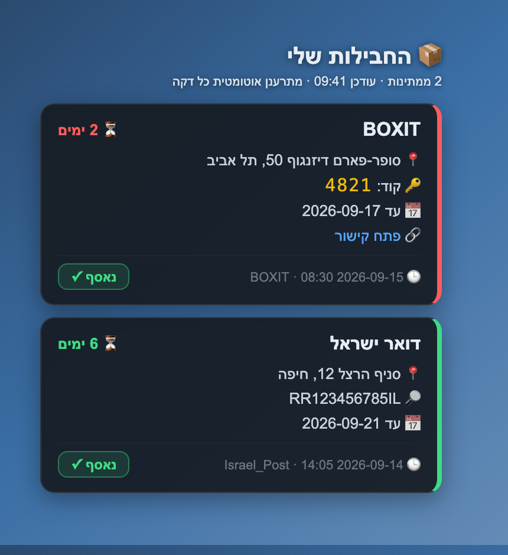

# 📦 Package Tracker

A tiny, private macOS tool that reads your synced iMessage/SMS, finds the
"your package is ready for pickup" texts from Israeli couriers, and shows them
as a clean, always-on **desktop widget** — courier, pickup location, time left
to collect, pickup code, and tracking number. Mark a parcel **collected** with
one click and it disappears for good.

<p align="center">
  
</p>

<p align="center"><sub>The desktop widget (sample data). Red = 2 days or less left.</sub></p>

Everything runs **locally on your Mac**. No message ever leaves your machine —
there's no server, no account, and no network calls.

> ⚠️ **macOS only.** It reads the local Messages database, so it needs a Mac
> **with your iPhone messages synced to it** (iMessage + Text Message
> Forwarding — see [Step 1](#step-1--sync-your-iphone-messages-to-the-mac)).
> There is no iPhone/Android app — Apple does not let apps read your SMS.

---

## What it does

- Scans the local Messages database for delivery/pickup notifications.
- Understands Israeli couriers & pickup points out of the box: **דואר ישראל
  (Israel Post), KSP, HFD, צ'יטה (Cheetah), BOXIT, Cubbo, Nexter, Runner, Mailog**
  and more.
- For each parcel it extracts:
  - 🏷️ **Courier** (sender)
  - 📍 **Pickup location** (branch / address)
  - ⏳ **Time left to collect** (from "עד <date>" or "X ימי עסקים")
  - 🔑 **Pickup code**
  - 🔎 **Tracking number**
  - 🔗 **Relevant link** (appointment / tracking), skipping marketing & unsubscribe links
- Filters out the noise — telecom data bundles ("חבילת גלישה"), coupons, sales,
  and other promos that merely contain the word "חבילה".
- **De-duplicates** the many update texts about the same parcel into one card.
- A **"נאסף ✓" (collected)** button on each card hides it permanently.

Red cards = 2 days or less left. Green = you still have time.

---

## Requirements

- macOS (tested on recent versions)
- **Messages synced to your Mac** (see Step 1)
- Python 3 (ships with macOS Command Line Tools)
- [Übersicht](https://tracesof.net/uebersicht/) — free desktop-widget app (for the widget; the CLI works without it)

---

## Step 1 — Sync your iPhone messages to the Mac

The tool reads `~/Library/Messages/chat.db`, so your texts must be on the Mac.
**Text Message Forwarding is the important part** — package notices usually
arrive as green-bubble **SMS**, not iMessage.

### On the iPhone
1. **Settings** → tap your name → **iCloud** → **Messages** → turn **on**
   (*Sync this iPhone*).
2. **Settings → Apps → Messages → Text Message Forwarding** → enable your Mac
   in the list. *(This is what brings plain SMS to the Mac.)*

### On the Mac
1. Open the **Messages** app.
2. **Messages → Settings → iMessage** → sign in with the **same Apple ID**.
3. Check **Enable Messages in iCloud** → **Sync Now**.

Both devices must use the same Apple ID. The first sync can take a few minutes.

---

## Step 2 — Get the tool

```bash
git clone https://github.com/raztassa2000-eng/package-tracker.git ~/Documents/Claude/package-tracker
```

> The Übersicht widget defaults to `~/Documents/Claude/package-tracker`. If you
> clone elsewhere, edit the `TOOL` path at the top of `ubersicht-widget.index.jsx`.

Try it from the terminal:

```bash
python3 ~/Documents/Claude/package-tracker/package_tracker.py
```

If you get a database permission error, do Step 3.

---

## Step 3 — Grant Full Disk Access

Reading the Messages database requires **Full Disk Access** for whatever runs
the script.

- **For terminal use:** System Settings → Privacy & Security → **Full Disk
  Access** → add your terminal app (e.g. Terminal / iTerm).
- **For the widget:** add **Übersicht** to the same list (see Step 4).

> **App Translocation gotcha:** if a freshly-downloaded app runs from a random
> `/private/var/.../AppTranslocation/...` path, Full Disk Access won't stick.
> Fix it once with:
> ```bash
> xattr -dr com.apple.quarantine /Applications/Übersicht.app
> ```
> then reopen the app from `/Applications`.

---

## Step 4 — Install the desktop widget (Übersicht)

1. Install and open [Übersicht](https://tracesof.net/uebersicht/). It's a
   menu-bar app — there's no main window; widgets render on the desktop.
2. Copy the widget into Übersicht's widgets folder:
   ```bash
   mkdir -p ~/"Library/Application Support/Übersicht/widgets/packages.widget"
   cp ~/Documents/Claude/package-tracker/ubersicht-widget.index.jsx \
      ~/"Library/Application Support/Übersicht/widgets/packages.widget/index.jsx"
   ```
3. Give **Übersicht** Full Disk Access (System Settings → Privacy & Security →
   Full Disk Access → **+** → Übersicht → toggle on).
4. Übersicht menu-bar icon → **Refresh All Widgets**.

The widget appears bottom-right and refreshes every 60 seconds. Change its
position by editing `bottom`/`right` in the `className` block of the widget.

---

## Usage (CLI)

```bash
python3 package_tracker.py            # active pickups, pretty table
python3 package_tracker.py --all      # include expired / already-collected-window
python3 package_tracker.py --days 60  # scan window in days (default 30)
python3 package_tracker.py --json     # machine-readable
python3 package_tracker.py --debug    # show the matched message text
```

**Mark collected / undo** (the widget button calls the first one for you):

```bash
python3 package_tracker.py --list-collected
python3 package_tracker.py --collect   <KEY>
python3 package_tracker.py --uncollect <KEY>
```

There's also a live-dashboard server mode (`--serve --port 7654`) if you'd
rather view it in a browser tab than a desktop widget.

---

## How detection works

A message is treated as a real pickup only if it contains a **strong pickup
phrase** (e.g. "מוכנה לאיסוף", "נקודת האיסוף", "קוד לקבלת החבילה", "דבר דואר")
**and** does not match the exclusion list (telecom bundles, coupons, sales,
in-store food counters, bureaucratic notices). Multiple updates about the same
parcel are merged by order/shipment id, and then by courier + location within a
30-day window, keeping the most detailed card.

Only messages from **2026-01-01 onward** are considered (`MIN_DATE`).

---

## Customizing

Open `package_tracker.py`:

- `COURIERS` — add courier name patterns → display names.
- `STRONG_PICKUP` / `EXCLUDE` — tune what counts as a pickup vs. noise.
- `SENDER_MAP` — map a courier's SMS gateway number to its name.
- `MIN_DATE` — earliest date to consider.

---

## Privacy

100% local. The tool reads your Messages database read-only, writes only a
`collected.txt` list of opaque hashes next to the script, and makes **no network
requests**. Nothing is uploaded anywhere.

---

## License

[MIT](LICENSE)
